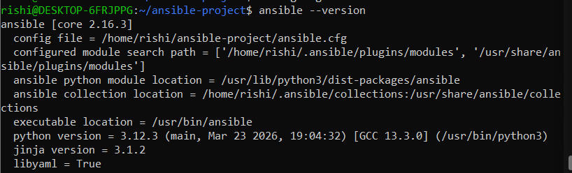
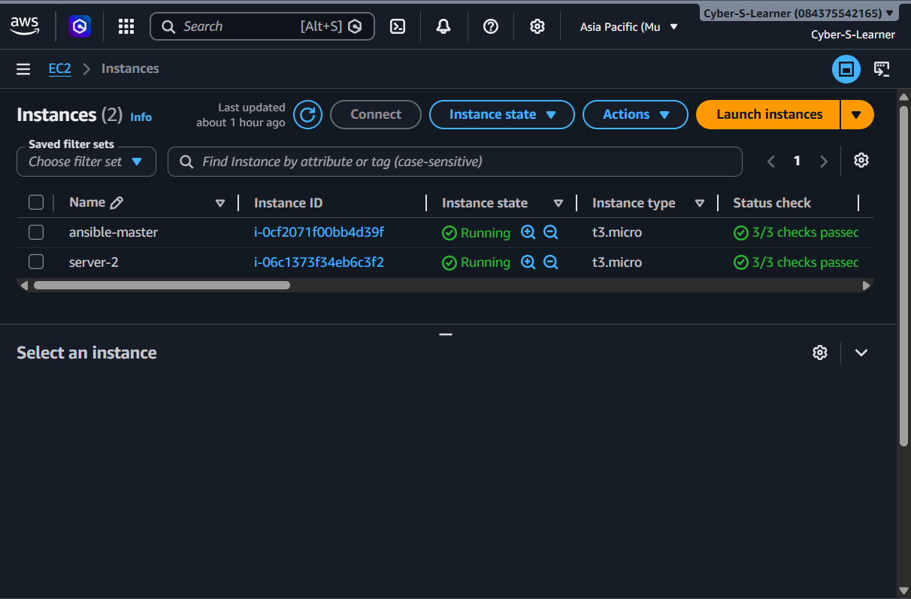
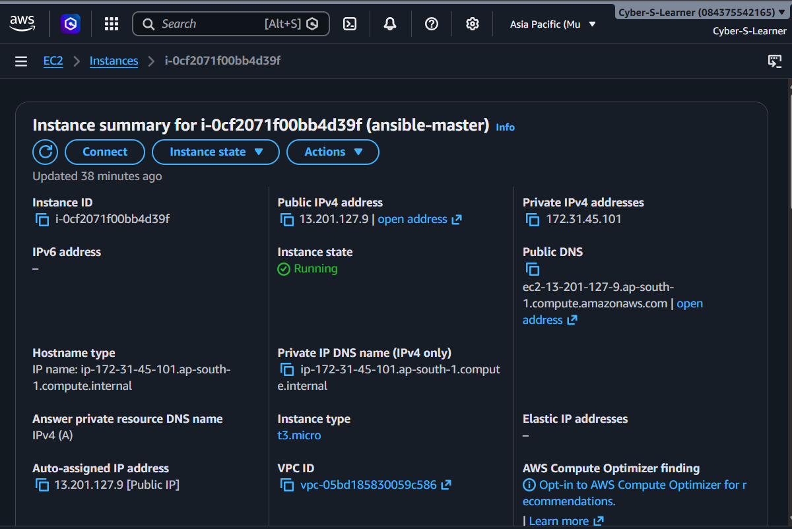
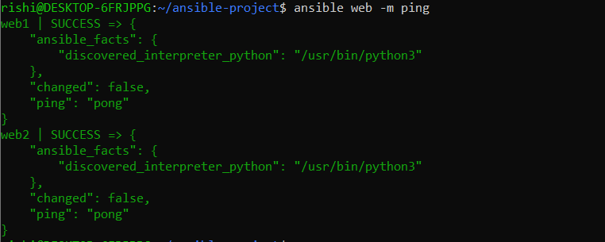
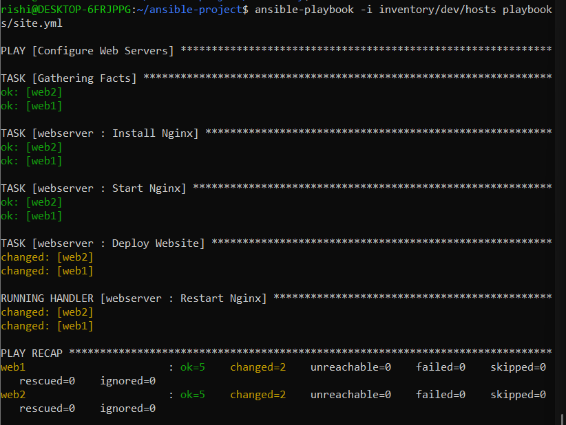
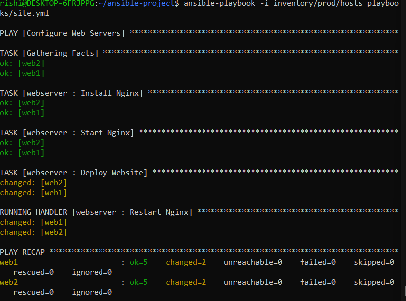
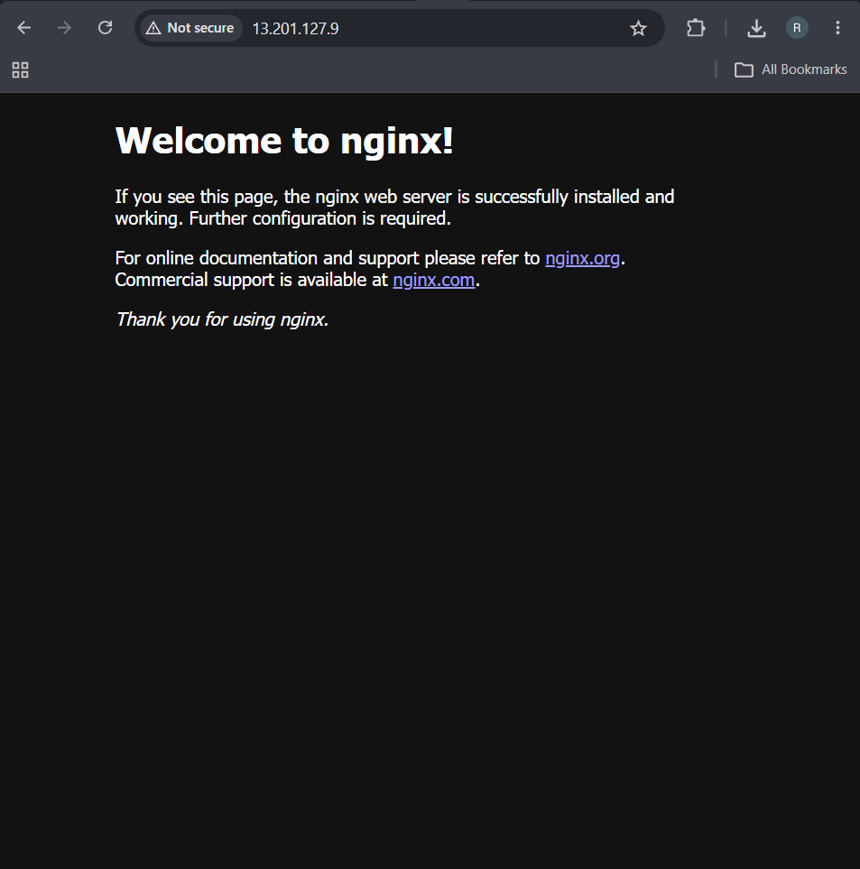

1. Project Overview

What does the project do?

Example:

This project demonstrates infrastructure automation using Ansible. It provisions and configures Ubuntu web servers by installing Nginx, managing services, deploying templates, and supporting multi-environment inventories using Ansible Roles.

2. Architecture

Include a simple diagram:

           WSL Ubuntu
        (Ansible Control Node)
                 │
        ┌────────┴────────┐
        │                 │
        ▼                 ▼
    Web Server 1      Web Server 2
      Ubuntu             Ubuntu

3. Technologies Used
- Ansible
- AWS EC2
- Ubuntu
- WSL
- SSH
- Jinja2
- YAML

4. Features

Example:

✅ User Management
✅ Package Installation
✅ Service Management
✅ Variables
✅ Handlers
✅ Templates
✅ Roles
✅ Multi-Server Management
✅ Dev & Prod Inventories

5. Project Structure

─ansible-server-automation-main
    ├───host_vars
    ├───inventory
    │   ├───dev
    │   │   ├───group_vars
    │   │   └───host_vars
    │   └───prod
    │       ├───group_vars
    │       └───host_vars
    ├───playbooks
    ├───roles
    │   └───webserver
    │       ├───defaults
    │       ├───handlers
    │       ├───meta
    │       ├───tasks
    │       ├───templates
    │       ├───tests
    │       └───vars
    └───screenshots

7. Prerequisites

- **Ubuntu WSL**
- **AWS Account**
- **EC2 Instances**
- **SSH Key**
- **Ansible installed**

7. Setup Instructions

Example:

git clone <repo>

cd ansible-server-automation

ansible-playbook -i inventory/dev/hosts playbooks/site.yml

9. Screenshots

### AWS Infrastructure
*Provisioned instances ready for configuration.*

### Connectivity Verification
*Verifying SSH connectivity and Ansible reachability.*

### Playbook Execution
*Running the automation playbooks on Dev and Prod environments.*

#### Dev Environment

#### Prod Environment

### Verification
*Nginx service running successfully on the remote server.*

10. Future Improvements

- Use Ansible Vault for secrets
- Dynamic AWS inventory
- Docker deployment
- Install Docker with Ansible
- Configure Jenkins
- Deploy Kubernetes components
